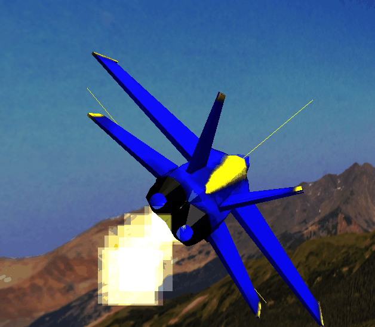

# airshow    
    
For this project I wanted to make and fly some jets!    
    
## notes:    
    
1. rotating the plane    
Had some issues with this. Placing the plane mesh in a THREE.Group object and rotating the mesh got me the current effect, which I think is good. 
However, I am unsure why rotating the plane mesh within a THREE.Group is different than rotating the mesh (or the group object) by itself relative to its own axis, as seen below:    
    
example of not-so-great rotation (imo) when rotating the THREE.Group on its own axis in object space:    
    
    
One issue though with the current strategy and using the THREE.Group is that during a vertical loop the orientation of the axes change, which changes the direction of motion on key press. Definitely something to investigate further.    
    
2. takeoff and landing    
For takeoff, the speed of the plane is increased exponentially (ex via Math.exp()), which looks fine to me visually. I also added a landing mode feature in which the plane descends at a constant speed while being parallel to the ground.    
    
3. jet engine exhaust/smoke    
Used the partykals.js library by RonenNess (https://github.com/RonenNess/partykals)    