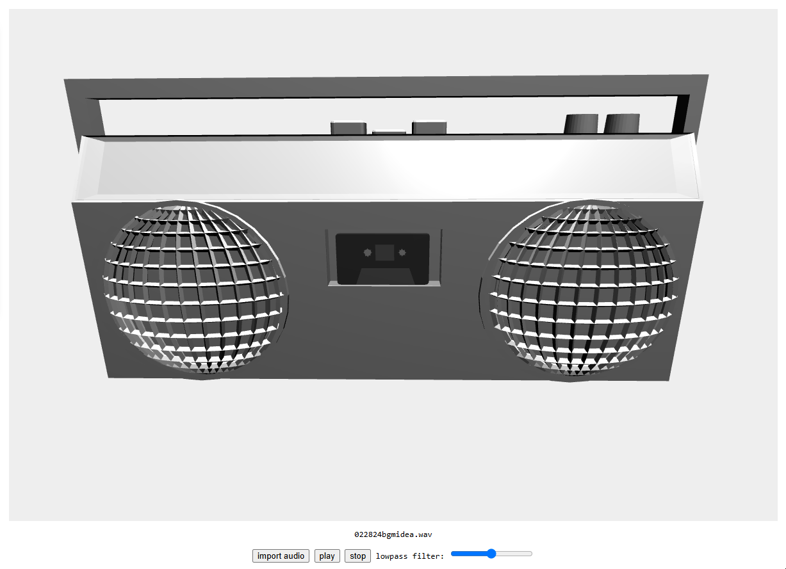

# boombox idea
    
A 3D boombox :D    
    
The boombox model utilizes shape keys (morph targets in Three.js) to transform the play/stop buttons of the model and for enlarging the meshes of the speakers based on the audio data.    
This demo also adds spatial audio and a lowpass filter with the help of the Web Audio API.
    
    