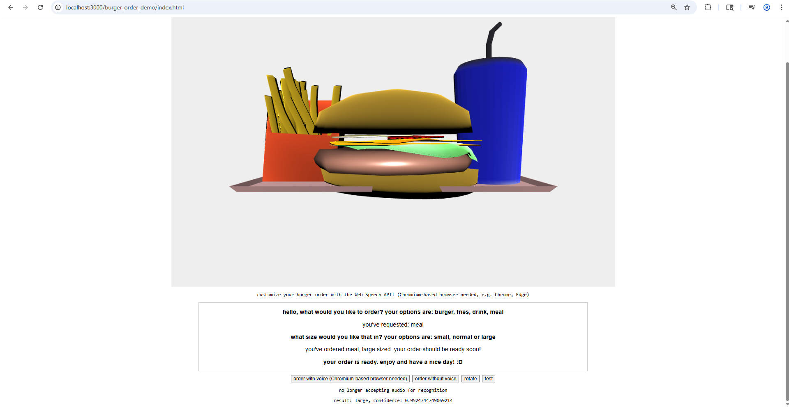

# burger order demo 
    
This project utilizes the Web Speech API to take your order! You can order fries, a drink, a burger or a meal!    
Note that the Web Speech API is currently only supported on Chromium-based browsers like Chrome and Edge, not Firefox.    
    
Some notes about the Blender models:    
- I made custom textures (using MS Paint) for the onion and tomato slices. To map the textures to the meshes, I created a new material, set it to image, assigned the image to use, and then opened the UV Editing tab at the top of Blender to be able to control which faces mapped to which parts of the image.
- for the lettuce, I initially made it a plane, subdivided it with loop cuts and moved some vertices around to make it a bit circular at some parts (with some proportional editing).
  - to get it to wrap more naturally around the burger patty, I added a rigid body to the patty, gave the lettuce cloth physics, moved the lettuce quite a bit above the patty and then played the animation forward to let it drop on the patty. I stopped the animation on the frame that gave me the result I wanted and applied the cloth physics so the lettuce would keep its shape. 
    
    