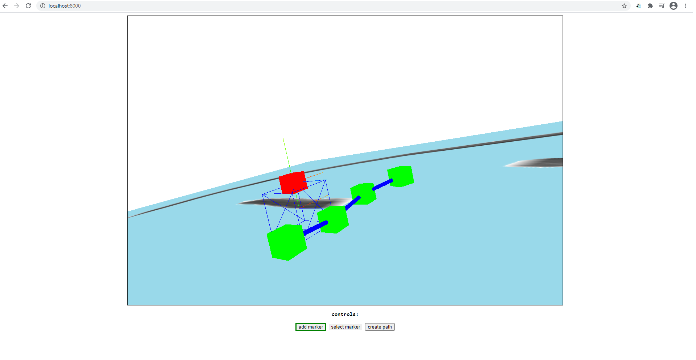

# camerawork    
### an experiment with moving a camera along a user-created path    
    
the user can create markers and paths between markers.    
    
    
camera view when following a path:    
   
    
For this demo, the camera is made to focus on the blue cube wireframe while it's moving along a path.    