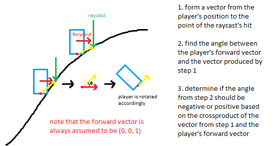

# snowboarding
    
This demo attempts to implement a snowboarding game without physics (so no colliders, gravity, etc.)! It extends some concepts from character demo and explores some new ones.    
    
some notes:    
- getting the snowboarder to match the angle of incline/decline when on a sloped surface    
assume forward vector is always (0, 0, 1) (so looking straight ahead relative to the snowboarder model) and find the angle needed to match the angle of the vector
formed by the point on the slope that's hit by the raycast.    
    
I think I've sorta tackled this problem as well in a different way in my car demo.    
    
    
    
- jumping logic was a bit tricky    
needed to know if player was still in the air by the time "jumping" should've ended (which means 1 full arc via sin()). for this I used another raycast to determine if the player is within a certain distance to be considered "on the ground".      
    
    