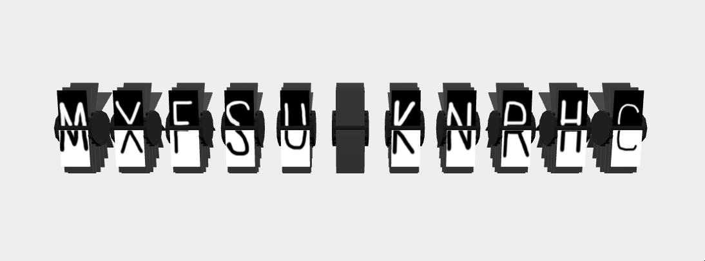

# split-flap display idea  
    
This is an implementation of a [split-flap display](https://en.wikipedia.org/wiki/Split-flap_display#) idea I had.    
    
I'm cheating a bit though in that I only have one animation that rotates the split-flap display about 45 degrees. Running the animation repeatedly though, at least in my opinion, makes it appear that the display is actually rotating all the way around and moving the flaps. Every time the animation ends, I switch the textures of the top and bottom flaps to a new, random letter from the alphabet.    
    
    