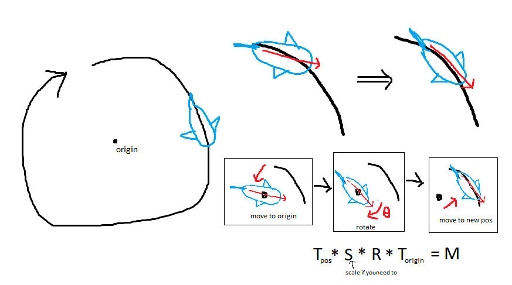

# super submarine    
    
You are a submarine tasked with some important objectives! you must disarm a dangerous capsule and recover some things from a sunken ship.   
       
## notes:    
    
1. rotating an object on a circular path    
I wanted to get the whale shark to swim in a circle while adjusting the direction its facing (currently not perfect but I think close enough).
To do this, during each update call I place the whale shark at the origin, rotate it, then place it at the next point along the path.
However, in terms of matrix multiplication, these steps need to be done backwards.    
        

    
2. togglable submarine spotlight    
Turning on/off the submarine's spotlight (via changing its visible property to true/false) is an expensive operation for rendering and causes some noticeable lag when toggled.