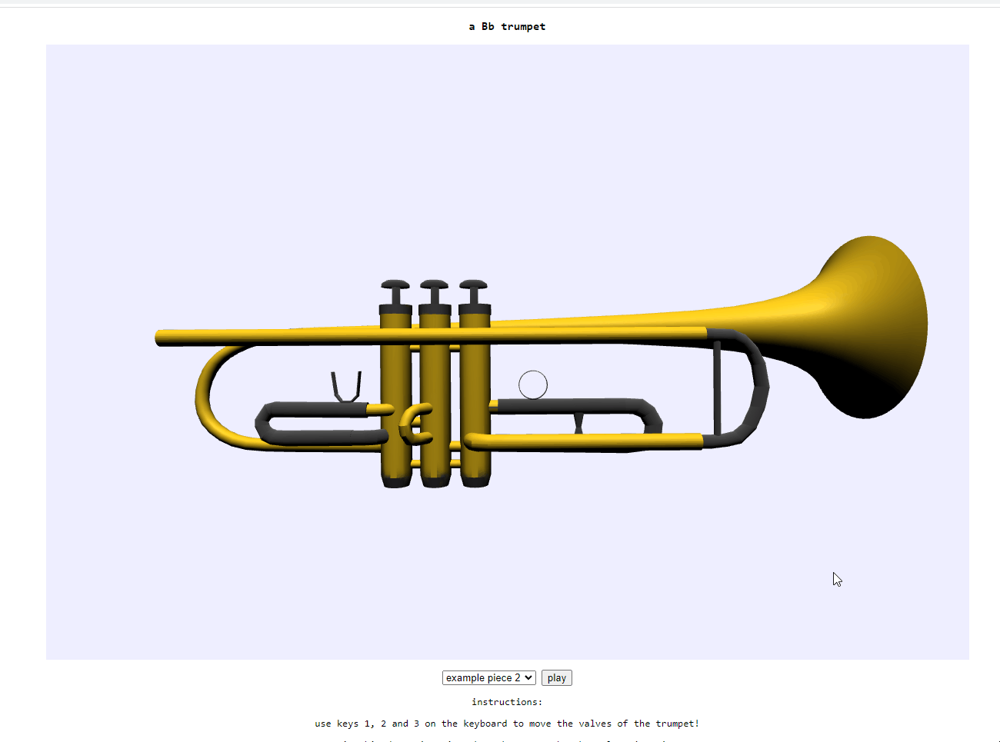

# Bb trumpet  
    
a 3D Bb trumpet! You can move the valves with the 1, 2 and 3 keyboard keys or play a demo that plays notes according to their fingerings.    
     
I also explored a bit how to get pitch from audio data and borrowed some of [Chris Wilson's code](https://github.com/cwilso/PitchDetect/blob/main/js/pitchdetect.js), which uses a technique called autocorrelation to determine pitch.    
    
You can try importing audio and see the trumpet fingerings sync with the calculated pitch on playback. A monophonic audio sample will likely work best. I've provided a .wav sample of me playing an excerpt of the main theme for the game "Medal of Honor: Pacific Assault", composed by Christoper Lennertz. Please don't expect too much :)    
    
    